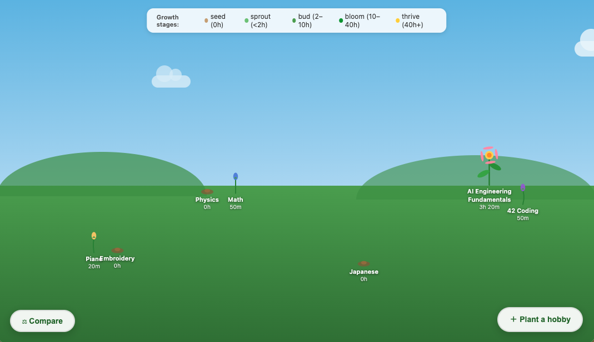

# Hobby Garden

A locally hosted app where your hobbies grow as flowers. The more time you spend on something, the bigger and more detailed its flower becomes.

The app is fully vibe-coded, because I wanted something working quickly instead of procrastinating and building myself a tool. 
All of the features that I've added are for my convenience. I wanted an app that would specifically focus on time spent instead of the fact of reaching a goal.

## Running it

You need [Node.js](https://nodejs.org) installed (no extra packages needed).

```bash
node server.js
```

Then open **http://localhost:3000** in your browser.

Press `Ctrl+C` in the terminal to stop the server.

## Data

Everything is saved to `data.json` in this folder. It's plain JSON — you can back it up, copy it to another machine, or open it in any text editor.

## Features

- **Total hours badge** — shows total time watered across all hobbies, top-right of the garden
- **Flowers grow** based on total time logged — 6 stages from seed to flourishing bloom
- **Each flower is unique** — petal shape, pattern, and center style are generated from the hobby's ID and revealed as it blooms
- **Quick Timer** — standalone Pomodoro-style timer (separate from any hobby's card) where you pick which hobby to water from a dropdown; free mode or countdown, set duration with a slider or by typing directly into the display, with 25m and 50m quick presets; plays a chime and shows a congratulations popup when a countdown finishes; closing the panel while a timer runs leaves a small floating widget on the garden so you can pause, log, or discard the session from anywhere
- **Manual logging** — log hours and minutes directly without using the timer, with a date picker to backdate a session (e.g. log yesterday's watering)
- **Session history** — see every watering session per hobby with the option to delete individual entries
- **Activity log** — write notes on what you did each session, stored per hobby
- **Wins tracker** — log small victories and milestones for each hobby
- **40h goal system** — progress tracks toward 40 hours; on completion you're prompted to spawn the next generation of the same flower as a fresh bud
- **Drag to reposition** — click and drag any flower to move it anywhere in the garden; position saves automatically
- **Compare view** — standalone comparison panel with four chart types: total hours (bar), hours over time (line, carries forward on days with no activity so slopes stay accurate), heatmap (GitHub-style activity grid, weeks start Monday, with avg/day, active days, longest streak, and best day stats), and goal progress (bar toward 40h per hobby)
- **Ambient bird sounds** — play/pause background birdsong while you work

## Growth stages

| Hours | Stage |
|-------|-------|
| 0 | Seed |
| < 2h | Sprout |
| 2–10h | Seedling |
| 10–40h | Budding |
| 40–120h | Blooming |
| 120h+ | Flourishing |

Flower patterns (petal shape, streaks, spots, bicolor, tip color) unlock at the Budding stage.

## Controls

- **Click** a flower — open its detail modal to log time manually or write notes
- **Click and drag** a flower — reposition it in the garden (position saves automatically)
- **+ Add hobby** button — create a new flower with a name and color
- **⏱ Timer** button — open the standalone Quick Timer and pick a hobby to water
- **⚖ Compare** button — open the comparison panel across all hobbies
- **🔇/🔊 Birds** button — toggle ambient bird sounds

## This is mine, create yours


## Credits

- Bird sounds by [hargissssound](https://freesound.org/people/hargissssound/) on Freesound
